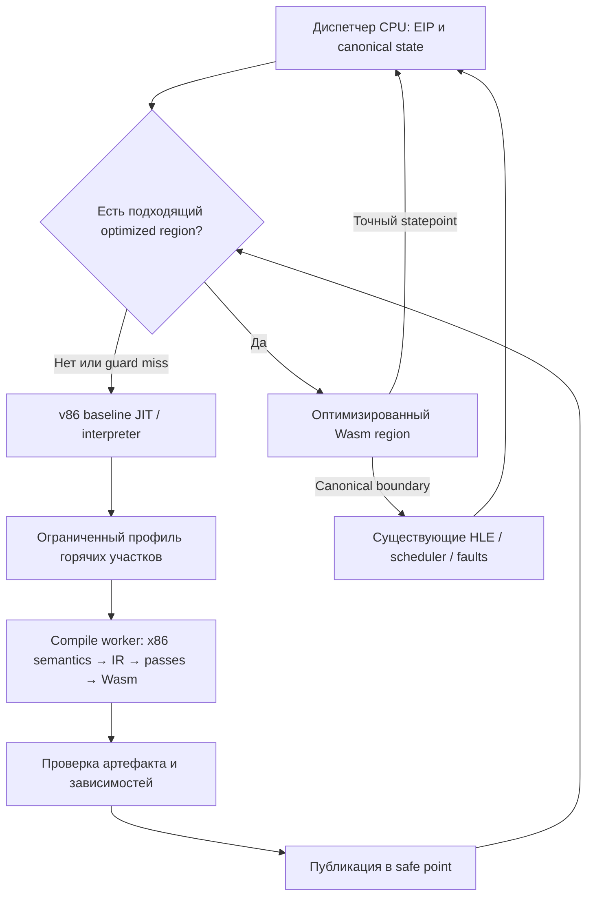

# Оптимизирующий x86 user-mode транслятор: архитектурное видение

Дата: 2026-09-04. Статус: проектное предложение, не реализованный backend и не performance claim.
Продолжает CPU-трек [плана v2](generic-cpu-hle-d3d-plan-v2-2026-09-04.md).

Цель исследования — проверить возможность **роста CPU throughput примерно в 2 раза** на
широком классе Win32-программ в браузере. Более высокие множители рассматриваются как
исследовательский потенциал отдельных классов вычислений, а не обещание всему приложению.

Рассмотрен текущий код BottleShip/v86 и исторические AOT-эксперименты. Новые benchmarks,
изменения runtime, сборки и переключения флагов в рамках этого документа не выполнялись.
Ссылки на старые контракты описывают их ревизии; при реализации ABI сверяется с текущим кодом.

## 1. Основная идея

Добавить к v86 оптимизирующий уровень, который переводит горячие участки x86 в собственное
семантическое IR, специализирует их под проверенное окружение Win32-процесса и генерирует Wasm.
v86 продолжает исполнять холодный код, неподдержанные инструкции и все случаи, в которых
условия специализации не выполнены.

Новый уровень должен изменить **объём работы на эквивалентное вычисление гостя**. Для этого
он получает знания, которые обычно потеряны к моменту генерации низкоуровневого Wasm:

- какие значения являются гостевыми регистрами, а какие — служебным состоянием эмулятора;
- какие арифметические flags понадобятся дальше, включая выходы и исключения;
- какие обращения относятся к одной проверенной области памяти;
- где программа действительно может наблюдать промежуточное состояние;
- какие вызовы являются известными HLE-операциями с ограниченными effects;
- какие call/return/indirect edges образуют часто исполняемую последовательность.

Перспективный результат: несколько десятков x86-инструкций, обслуживающих одно вычисление,
превращаются в компактную последовательность host-операций с небольшим числом проверок
на входах и точными выходами. Guards проверяют предпосылки, а statepoints позволяют
продолжить исполнение в v86 с корректного места.

Это поэтапное дополнение к существующему движку. Первый полезный результат не требует
замены всего CPU, loader, scheduler, SEH, HLE или графического backend.

## 2. Что именно означает «рост MIPS»

Нужно различать три метрики:

| Метрика | Определение | На что отвечает |
|---|---|---|
| Wall MIPS | Guest instruction count / elapsed wall time | Сколько гостевой работы приложение получает в секунду, включая паузы на HLE/D3D |
| CPU throughput | Фиксированная гостевая работа / время CPU-исполнения с dispatch и обязательными helpers | Стал ли сам транслятор быстрее |
| Application throughput | FPS, время загрузки, декодированные samples и т. п. при одинаковой работе | Получил ли пользователь ускорение |

Исторические 174.3 MIPS NFSU — первая метрика:
[исходный отчёт](../../plan/nfsu-perf-report-2026-08-28.md).
Это не измеренный предел скорости непрерывного исполнения x86. Нельзя делить instruction
count одного окна на JIT-time другого окна и выдавать результат за CPU throughput.

Если HLE заменяет гостевой цикл, реально декодированных/исполненных x86-инструкций может
стать меньше при большей полезной производительности. Поэтому основная метрика исследования —
**время одинакового вычисления**. Baseline-equivalent instruction count допустим только как
явно помеченный logical-work counter; он не выдаётся за физически выполненные инструкции.

Пусть S — доля исходного CPU-времени, которую покрывает новый путь, X — его локальное
ускорение с guards/exits, C — дополнительная цена, ещё не включённая в X, нормированная на
baseline: overhead непокрытого пути и амортизированные compile/publication расходы.

```text
CPU speedup = 1 / ((1 - S) + S / X + C)
```

| S по времени | X | Идеальный CPU speedup при C=0 |
|---:|---:|---:|
| 50% | 2x | 1.33x |
| 75% | 3x | 2.00x |
| 80% | 3x | 2.14x |
| 90% | 4x | 3.08x |

Именно поэтому нужны generic классы оптимизаций, а не один очень быстрый редкий kernel.
И это ещё не FPS: при доле CPU 43% кадра ускорение этого CPU вдвое даёт около 1.27x по кадру,
если остальные расходы неизменны. Доля 43% здесь только иллюстрация из исторического бюджета.

## 3. Что уже есть и что пока не доказано

В текущем v86 уже есть GPR locals, dead-flag optimizations, multi-block modules,
RET/indirect speculation и chaining, SIMD/FP lowering, WBUF CALL intrinsic и AOT delivery.
Часть возможностей экспериментальна или выключена в shipping envelope. Конфигурация читается
из [shipping.mjs](../../tools/jit-config/shipping.mjs), а не из предположения «фича есть в коде».

Новые компоненты должны оправдываться следующим различием:

| Уже существует | Предлагаемое расширение |
|---|---|
| GPR в Wasm locals | SSA-оптимизация значений и effects через несколько guest blocks/calls |
| Проверка памяти на каждом доступе, экспериментальные кеши | Проверенное право выполнить группу обращений без повторной полной проверки |
| Локальные flags/FP-оптимизации | Liveness и representation selection с полным описанием statepoints |
| JIT block/region formation | Выбор regions по измеренной экономии и стоимости side exits |
| WBUF CALL intrinsic | Специализированные effect operations с устранением повторной preparation |
| AOT публикация и кеш | Доставка оптимизированного кода с сохранением baseline для всех остальных входов |

Старый LLVM backend давал 0.72–0.82x, а эксперимент 5.08x снимал часть обязательств.
Это доказывает ни достижимость 5x, ни невозможность 2x с другим execution contract.
Источник: [AOT verdict](../../plan/aot-absorption-verdict-2026-08-28.md).

Отдельная поправка к интерпретации прошлых отчётов: примерно 52–53% «plumbing» были долей
**Wasm opcodes** в статическом разборе. `local.get` и `const` не переводятся один к одному
в дорогие host instructions. Эта цифра не является 52% измеренного CPU-времени и сама
по себе не даёт потолка ускорения. Понадобятся actual generated code и runtime attribution.

Неудачи broad regions, generic inline WBUF, x87 locals, micro-TLB и fastmem writes остаются
входными ограничениями: [negative results](negative-results.md). Повторять их имеет смысл
только с новым механизмом и отдельным объяснением исчезающей работы.

## 4. Место в системе



Canonical state — привычное runtime-представление регистров, flags, FPU/SSE, EIP и счётчиков,
которое понимают v86, HLE и scheduler. Пока region работает без наблюдаемой границы, часть
этого состояния существует только в SSA/Wasm locals. На выходе оно восстанавливается.

Первый уровень dispatch между baseline и optimized проходит через этот canonical state.
Приватный state-carrying ABI между optimized regions рассматривается позже, только если
замеры показывают существенную цену этих переходов. Большой ABI с десятками параметров
не принимается автоматически: host compiler может превратить его в stack traffic.

Холодный запуск всегда работоспособен на baseline. Компиляция не блокирует готовность
приложения; результат публикуется только после проверки актуальности code bytes и environment.

## 5. Контракт user mode: какие факты доступны оптимизатору

Предлагается versioned execution envelope. Он содержит только проверенные свойства:

- режим декодирования, CPL, address/operand sizes;
- необходимые segment bases/limits и правила применения FS к текущему thread context;
- memory-layout ABI, mapping/protection semantics и допустимые классы RAM;
- FPU/SSE representation, control modes и правила исключений;
- engine/helper/intrinsic ABI versions;
- single-CPU execution model и правила внешних изменений памяти;
- scheduler budget и наблюдаемые точки передачи управления;
- идентичность исполняемого кода и generation зависимостей.

Постоянный DS/SS base можно подставить только в рамках соответствующего envelope. FS нельзя
заморозить между переключениями threads. Указатель на heap object не считается неизменным
из-за того, что сто прошлых запусков дали одно значение.

Envelope отделяет **типичные доказуемые условия** от случайно наблюдённых значений.
Изменение условия либо проверяется guard, либо завершает scope, либо инвалидирует код.
Для каждого поля должен быть назван owner, меняющий generation; «epoch где-нибудь обновится»
не является механизмом корректности.

Успех не следует из удаления BIOS/устройств из сборки: если они не исполняются в горячем пути,
их отсутствие ничего не экономит. Ценность user-mode специализации — более сильные
доказательства на реально исполняемых accesses, branches и helpers.

## 6. Собственное IR

### 6.1 Уровни представления

Предлагаются три стадии:

1. **Guest IR:** x86 operations, частичные регистры, EFLAGS, сегменты, fault points и порядок.
2. **Optimizing IR:** SSA values, memory/effect dependencies, guards, statepoints, loops.
3. **Wasm lowering:** конкретные locals, imports, memory instructions и structured control flow.

Оптимизация по уже эмитированным Wasm bytes остаётся полезной для узких peepholes.
Для межблочных alias/exception proofs нужна семантика выше этого уровня. Это осознанное
отличие от старого предложения «annotate emission, optimize bytes», а не ещё один emitter.

### 6.2 Какие сущности должны быть явными

```text
Value:       i8 / i16 / i32 / i64 / f32 / f64 / v128 / tagged-x87
GuestState:  GPR values, partial-register merges, flag recipes, FP/SIMD state
Address:     guest offset + segment semantics + access width
MemoryOp:    read/write/RMW, alias class, required permissions, guest PC
Effect:      guest-memory, runtime-state, mapping, code, I/O, callback, scheduler
Guard:       predicate + dependency set + miss continuation
Statepoint:  guest continuation + state reconstruction + count delta
Region:      entry envelope + CFG + exits + code dependencies
```

Это проектная схема, не готовый сериализованный ABI.

Каждый potentially observable/faulting operation несёт исходный guest PC и statepoint.
Чтение памяти не объявляется pure только потому, что его результат похож на обычный load:
оно может fault, читать MMIO или влиять на page metadata.

На первом этапе можно использовать один консервативный memory-effect chain. Разделение alias
classes вводится только для доказанно независимых storage. CPU-state, guest heap и stack
должны различаться семантически, но engine layout и dynamic address bounds обязаны доказывать,
что конкретный guest access не попадает в служебную область.

### 6.3 Flags и частичные регистры

`AL/AH/AX/EAX` описываются как чтения/обновления частей одного значения. Слияние нельзя
заменять независимыми locals без merge semantics. Carry от ADD остаётся живым через INC,
даже если остальные арифметические flags определены последней инструкцией.

Flag recipe хранит достаточные исходные SSA values для восстановления точного состояния
на любом выходе. Вычислять все flags заранее не требуется; потерять нужные входы рецепта нельзя.
Неарифметические EFLAGS и undefined-bit policy должны соответствовать runtime contract.

## 7. Память: основной кандидат на изменение стоимости исполнения

### 7.1 Что делает текущий путь

`codegen.rs::gen_safe_read` описывает текущую форму: извлечение page index, TLB entry,
проверка permission flags и page crossing, затем access либо slow helper.
Read-fastmem из старых AOT-расчётов удалён из нынешнего shipping contract.

Точный выигрыш этой работы пока не определён: inline TLB может быть очень дешёвым,
а pointer-chasing может ограничиваться host cache misses, которые новый IR не устранит.
Нужен разбор full memory operation вместе с fault preparation, а не подсчёт отдельных `and`.

### 7.2 Scoped memory proof

Guard на входе короткого scope доказывает для группы accesses:

- корректность guest address arithmetic, включая wrap и segment rules;
- mapping и требуемые права для всех затрагиваемых страниц;
- обычную RAM, а не MMIO, watchpoint или специальный runtime storage;
- для stores — отсутствие code/SMC и иных write-barrier obligations, которые нельзя убрать;
- неизменность этих фактов до конца scope;
- корректный режим accessed/dirty bookkeeping.

Внутри scope memory operations используют уже доказанную адресацию. Размер scope выбирается
по стоимости guards, числу accesses и side exits; region и memory scope не обязаны совпадать.
Один region может содержать несколько scopes и обычные safe accesses между ними.

MVP ограничивается одним исполняющим guest CPU, обычными стабильными RAM pages и коротким
участком без helpers/callbacks/mapping writes. Он не требует глобального fastmem режима.

### 7.3 Пример и точная семантика отказа

```asm
mov eax, [esi]
add eax, [esi + 4]
mov [edi], eax
inc ecx
```

Если можно доказать корректность двух reads и store на всём участке, generated path
выполняет их прямо и сохраняет recipe для flags. Алиас `edi == esi` сам по себе не мешает,
пока порядок reads→store сохранён. Для иных перестановок потребуется более сильный alias proof.

Если проверка `[esi+4]` не прошла, нельзя сразу генерировать #PF: первая MOV могла успешно
выполниться и изменить EAX. Guard **отказывает до первого side effect**, baseline начинает
с исходной MOV и получает fault в предусмотренном месте с нужным EAX.

Второй вариант для длинного региона — завершить предыдущий scope, материализовать state
и отказаться с начала следующего. Повторное исполнение уже совершённых stores запрещено.

### 7.4 Metadata и сам модифицирующийся код

Нельзя заранее выставить A/D bits для страницы, к которой guest ещё может не обратиться.
Для первого MVP допустимо требовать уже подходящее состояние metadata на всех accesses;
иначе baseline выполняет работу. Более широкий путь отдельно воспроизводит metadata effects
в исходном порядке. Guard lookup сам не должен создавать guest-visible side effects.

Scope заканчивается до возможных изменений page tables, protections, mapping, code status,
debug mode или runtime reentry. Guest stores в page-table/code/runtime страницы отклоняются
обычным guarded path. JS-публикация кода использует существующего владельца invalidation.

В single-worker исполнении отсутствие yield/reentry позволяет исключить JS-изменение mapping
в середине scope. Это **не** переносится автоматически на guest SMP или стороннего writer
shared RAM: проверка epoch на входе не предотвращает concurrent unmap после проверки.
Такой режим требует другого lifetime/serialization contract и отдельного acceptance.

### 7.5 Чего нельзя ожидать от памяти браузера

Wasm bounds protection не реализует guest VirtualProtect/SEH/SMC. Доступ к выделенной linear
memory может быть разрешён браузером и запрещён гостю. Host Wasm trap не используется как
неявная замена guest #PF и не считается универсальным способом возобновиться с нужной x86 PC.

Multi-memory/отдельный CPU-state storage — опциональный эксперимент для alias analysis.
Он имеет смысл, если host disassembly подтверждает лишние state reloads. Ни отдельный
memory index, ни перенос структуры сами по себе не гарантируют, что V8 удалит нужные loads.
Необходимы реально независимые backing stores и измерение generated code.

## 8. Точные выходы и исключения

### 8.1 Statepoint как обязательный результат компиляции

Для каждого выхода компилятор генерирует описание:

- EIP/previous EIP по актуальному engine convention;
- восемь GPR и способы восстановления частичных updates;
- flags или достаточный lazy tuple;
- x87 values/tags/TOP/control/status и SSE/XMM/MXCSR по dirty mask;
- instruction-accounting delta и scheduler continuation;
- reason и точку, с которой baseline продолжит исполнение.

Reconstruction использует уже сохранённые SSA values и безопасную pure rematerialization.
Она не перечитывает произвольную guest memory: значение могло измениться, чтение может fault,
а повторный MMIO access может иметь новый effect. Издержки сохранения reconstruction values
входят в register pressure и performance model.

### 8.2 Классы границ

| Граница | Действие |
|---|---|
| Entry guard miss | Ни одного guest side effect; точный baseline entry |
| Cold branch/indirect miss | Materialize текущее состояние; продолжить по вычисленному guest target |
| Memory proof miss | Вернуться к началу ещё не исполненного scope |
| Реальный #PF/#DE/иной fault | Сохранить именно fault-time state и использовать проверенный engine fault path |
| Неизвестный helper/OUT/WinAPI | Canonical state; baseline исполняет существующую boundary semantics |
| Budget/interrupt stop | Commit счётчиков и state; вернуть управление scheduler в допустимой точке |
| Invalidation | Не входить в stale region; активный scope обязан завершиться до изменения предпосылок |

Промах guard не является guest exception. Реальный fault не является обычным deopt.
Смешение этих случаев — источник неверного EIP, повторных stores и неправильного SEH.

### 8.3 Reentry и callbacks

В BottleShip возможны nested guest calls из thunk. Поэтому первый production slice
не сохраняет приватное guest state через произвольный HLE-вызов. Он заканчивается перед
существующим thunk path; после callback/park/thread switch новый вход заново читает canonical state.

FP dirty flags нужно выставлять по требованиям каждого trap segment, а не один раз на
долгую жизнь region. Runtime может очистить их при промежуточном save. Старый контракт
содержит конкретные примеры: [AOT module contract](../../plan/aot-module-contract.md).

## 9. Instruction accounting и виртуальное время

Generated code может исполнять меньше host operations, но обязан сохранять принятую
runtime policy счётчика гостевой работы, quantum и virtual-time boundaries.

У каждой CFG-edge есть соответствующая дельта исходной работы. При loop optimization
дельта зависит от фактически завершённых iterations и пути. Она не начисляется заранее
за блок, который потом fault или side-exit. Конкретные fault-count conventions сверяются
с актуальным v86: слово retired не заменяет проверку реализации счётчика.

Budget проверяется на входе и в предусмотренных checkpoints, включая длинные прямые участки.
При малом остатке region выполняет короткий разрешённый prefix либо отказывается.
Допустимое overshoot и места переключения задаются runtime contract; новый compiler
не меняет их молча ради более длинного непрерывного исполнения.

Urgent-exit signal, RDTSC/time APIs и helpers с наблюдением счётчиков входят в effects.
Оптимизация счётчиков возможна между такими наблюдениями; интерфейс должен согласовать
видимость pending delta. Нельзя переиспользовать историческую counter staleness как
лицензию держать счётчик произвольно устаревшим.

При HLE замене целой функции отдельно определяются logical accounting и pacing.
Рост счётчика без соответствующего ускорения fixed-work workload не является ростом MIPS.

## 10. Как строятся regions

### 10.1 Профиль выбирает кандидатов, guards обеспечивают корректность

Начальная единица — hot path с entry envelope, несколькими blocks, direct calls/returns,
ограниченным числом устойчивых indirect targets и холодными exits.
Entry не обязан совпадать с символом функции, и binary symbols для production не требуются.

Вызовы и возвраты можно включать в CFG, сохраняя guest stack writes, return-address reads,
faults и возможность изменения return target. Внутренний переход не означает, что guest CALL/RET
перестали иметь эффекты. Stack-slot elimination — отдельная оптимизация с alias proof.

Из профиля нужны time-weighted edges, вероятность продолжения, число eliminated materializations,
тип accesses, helper fences, code stability и live-value pressure. Наблюдённый indirect target
проверяется на исполнении. Обнаружение нового target приводит к side exit, а не к неверной ветке.

### 10.2 Почему не один огромный trace

Длинный region может увеличить register pressure, compile time, code size и число guards,
а редко достигаемый хвост не окупит подготовку. Компилятор выбирает размер по ожидаемой
экономии, а не по максимальному числу инструкций.

Практическая модель кандидата:

```text
benefit = baseline cost on covered paths
        - optimized compute
        - guards / statepoints / misses
        - added cost on baseline paths
        - amortized compile and publication
```

MVP использует bounded regions и ограниченное число версий на entry. При нестабильности —
backoff/eviction с ограниченной памятью. Никакого unbounded cloning по входным значениям.
Профиль с высокой retired coverage и низкой time coverage не считается достаточным.

## 11. Оптимизации и порядок их добавления

| Проход | Источник экономии | Что ограничивает применимость |
|---|---|---|
| Constant propagation, CSE | Повторная арифметика/адресация | Wrap semantics, flags, effect barriers |
| Flag liveness / recipes | Ненужные flag computations/stores | Все exits/faults/consumers должны восстановить нужные bits |
| Scoped memory proofs | Повторная memory/exception preparation | Mapping, A/D, code barriers, concurrency |
| Load forwarding | Повторные loads | Alias, width, partial writes, fault effects |
| Stack scalar replacement | Промежуточные stack loads/stores | Escape, alias, callbacks, guest-visible stack inspection |
| LICM / address induction | Повторная loop work | Exceptions, overflow, side effects, entry/exit paths |
| Hot call/return fusion | Dispatch и materialization | Return target/stack semantics, code size |
| FP/SIMD value forwarding | Повторная FPU/XMM state traffic | Tags, modes, rounding, exception/status state |
| Loop vectorization | Несколько независимых scalar iterations | Alias и dependence proofs, exact arithmetic/FP policy |
| Effect-aware intrinsics | Known API/helper overhead | Versioned semantics, exact fallback и accounting |

Каждый проход включается отдельно. Сначала сформировать корректное IR с консервативным
lowering, затем принимать изменения по ablation. Малое число Wasm opcodes не является gate.

## 12. FP/SIMD и смешанные regions

Integer-only compiler полезен как первый проверяемый slice, но может терять hot coverage
на одной встреченной FILD/FSTP/SSE инструкции. Поэтому есть три уровня поддержки opcode:

1. Собственная оптимизируемая семантика в IR.
2. Проверенный helper/fence с известным состоянием до и после.
3. Завершение region и baseline fallback перед инструкцией.

Уровень 2 не считается бесплатным: materialization может съесть весь выигрыш. Если безопасного
adapter нет, применяется уровень 3. Нельзя обещать 100% coverage простым подключением старого
emitter — его JitContext, locals и exception assumptions нужно согласовать с новым IR.

Для x87 сохраняется **нынешний выбранный режим runtime**, включая строгие и relaxed paths,
TOP, теги, control/status и переходы mixed representations. Документ не разрешает новое
снижение точности. Округление после guest операции нельзя убрать лишь потому, что промежуточный
результат ещё находится в f64 local.

Для SSE учитываются scalar lane preservation, packed behavior, MXCSR, comparisons/conversions,
NaN и denormals в поддержанном контракте. Перегруппировка FP reductions запрещена без отдельной
семантической гарантии. Векторизация независимых целочисленных/битовых iterations — более
узкий старт, чем обещание SIMD для любого float loop.

## 13. HLE как часть compiler contract

В текущем коде уже есть WBUF CALL intrinsic. Новый IR может представлять допустимые вызовы
как operations с явно заданными эффектами, вместо непрозрачного «вызова чего-то в runtime».

Descriptor должен содержать ABI, прочитанные/изменённые части state, ranges памяти,
возможные faults, refcounts, ordering, callback/blocking и instruction-accounting policy.
Одна таблица семантики обслуживает runtime registration, guards и compiler lowering.

Первый шаг — специализированные hot callsites с существующим helper и точным fallback.
Следующий — устранение повторной descriptor lookup, argument preparation или validation,
если proof scope покрывает несколько operations. Массовое inlining всех API исключается
из MVP: предыдущая попытка generic inline WBUF регрессировала по code size.

API, который потенциально callback/park/switches threads, завершает private-state scope.
Нельзя делать вывод «sync» по имени API или одному прошлому return. Для полностью известного
non-reentrant intrinsic допустим более узкий ABI; его свойства доказываются отдельно.

Static-library HLE остаётся в границах CLAUDE §3.8: чистые листья и допустимые simple-state
контракты. Произвольные игровые controllers не заменяются выдуманной моделью состояния.
Оптимизация исходного кода controller обычными семантически корректными compiler passes
допустима: она сохраняет его исходные branches/writes и не является ручной HLE-подменой.

## 14. Интеграция: новое IR не означает новую реализацию всего x86

### 14.1 Источник семантики

Предпочтение — отдельное Rust compiler core, собираемое в Wasm для compile worker и имеющее
чистый API «bytes + decoded context + profile → artifact». Оно не исполняет guest-код и
не читает runtime globals по фиксированным абсолютным адресам.

Причина такого разделения практическая: старый AOT driver зависит от v86 layout и имеет
ограничения для native execution. Новому compiler core эти зависимости не нужны.
Offline host на Bun/Node и browser worker используют один и тот же compiler artifact.

Переиспользуются opcode metadata, decoder infrastructure там, где интерфейс действительно
подходит, существующие validators и semantic tests. Для MVP добавляется небольшой явный набор
IR semantics с differential относительно v86. `tools/aot/lib/decode.mjs` — полезный существующий
slice, но не готовый полный decoder нового компилятора.

Нельзя заявлять correctness-by-reuse там, где old lowering уже смешал decode, CPU globals,
control-flow emission и helper ABI. Такая граница требует adapter или fallback.

### 14.2 Доставка и coexistence

Существующий `aot-cache.ts` умеет prepare/validate/transactional publish, content binding,
проверку function identity и инвалидирование. Эти механизмы используются как база.

Однако его текущая модель связана с table slots, page ownership и набором entry points.
Новый region не должен вытеснять baseline со страницы, если поддерживает только некоторые
её входы. Поэтому production-интеграции нужен **явный coexistence contract**.

Предлагаемое направление — дополнительная ограниченная optimized-entry registry, связанная
с существующим владельцем CPU dispatch. Ключ: process incarnation, guest EIP, mode/envelope,
generation зависимостей. Baseline page ownership сохраняется для остальных входов.

Это новый runtime механизм, а не утверждение, что таблица уже существует. Она должна
использовать общий allocator/проверку table identity, owner invalidation и transactional
publication; не создавать несогласованный второй кеш страниц.

До её реализации kernel-эксперимент может вызывать проверенный adapter в изолированном
стенде. Такой вызов доказывает скорость kernel, но ещё не измеряет production dispatch overhead.
Интегрированный arm обязателен до обещания приложению.

Первый внешний ABI остаётся совместимым с engine entry/exit; любые дополнительные функции,
imports или новая форма state требуют version bump и расширения verifier. Старый verifier,
рассчитанный на одну локальную функцию, не объявляется совместимым по умолчанию.

### 14.3 Публикация, инвалидация, persistence

1. На CPU safe point захватить consistent code bytes, profile и environment.
2. Compile worker генерирует Wasm, dependencies, relocations и verifier metadata.
3. Runtime проверяет code hashes, semantic/compiler versions и актуальный envelope повторно.
4. Prepare выполняется до synchronous commit; между последней validation и publication нет await.
5. Изменение любой dependency снимает entry с публикации; stale artifacts не входят в dispatch.

На разных запусках используются content/version keys, а не runtime page generations,
которые могут начать отсчёт заново. Ключ включает code/relocations, compiler+pass version,
engine/memory/helper ABI, FP policy и необходимые Wasm features. Guest addresses не являются
универсальной идентичностью кода; profile допускает relocation-aware нормализацию.

Persisted Wasm не означает persisted peak-performance native code. Браузер всё равно
выполняет свою compilation/tiering policy. Отдельно учитываются холодный запуск, warmup
и steady state, время компиляции и размер кеша.

## 15. Browser codegen как часть эксперимента

Собственное IR убирает семантически лишнюю работу; host compiler размещает значения в
регистрах и переводит Wasm в native instructions. Оба уровня влияют на результат.

V8 документирует baseline и optimizing compilation, различия debugging/profiling и
отсутствие on-stack replacement для описанного Wasm pipeline. Поэтому огромная долгоживущая
активация может мешать переходу к оптимизированному коду; bounded возвраты полезны не только
для scheduler. Эти свойства проверяются на целевой browser revision:
[V8 compilation pipeline](https://v8.dev/docs/wasm-compilation-pipeline).

Нужны cold/warm/default-browser измерения и отдельные диагностические arms с принудительным
tiering режимом. Последние не являются условием запуска продукта. Host disassembly помогает
найти spills, лишние reloads и стоимость guards, но окончательное решение принимает timing.

Wasm tail calls не равны автоматически бесплатной передаче большого guest state: их lowering
зависит от tier, а контракт параметров остаётся нашим.
[V8 tail calls](https://v8.dev/blog/wasm-tail-call).

## 16. Как доказать потенциал до большого проекта

### 16.1 Четыре arms, каждый отвечает на свой вопрос

| Arm | Содержание | Назначение |
|---|---|---|
| A — baseline | Текущий shipping v86, фактический config readback | Исходная цена fixed work |
| B — lifted control | Новое IR без оптимизаций, полный contract | Цена новой инфраструктуры и корректность lifter |
| C — optimized | Тот же IR/contract с одним или несколькими именованными passes | Причинный выигрыш механизма |
| D — direct Wasm diagnostic | Прямая реализация того же вычисления с явно перечисленными отличиями окружения | Ориентир compute cost, не shipping speedup и не доказанный достижимый потолок |

C должен обгонять A, а не только дорогой B. D не используется в таблице accepted gains.
Если D очень быстр, а C остаётся медленным, надо назвать обязательство, которое съедает
разницу. Если D тоже близок к A, переписывание emitter не обещает крупного выигрыша этому kernel.

### 16.2 Корпус

Начать с трёх классов, извлечённых из реально горячего кода, и диагностических fixtures:

- memory/branch/object traversal с pointer chasing;
- численные циклы с x87/SSE и промежуточным state traffic;
- call/return-heavy glue и известные HLE boundaries.

Captured input включает bytes, relevant CPU state, page map, permissions и ожидаемые effects.
Replay выполняет фиксированную работу, не цикл «крутиться N миллисекунд», и проверяет outputs.
Real workload обязателен: synthetic fixture даёт контролируемый ответ только своему классу.

Перед расширением — несколько настоящих приложений с разными распределениями CPU-времени.
Если игр нет на стенде, это пробел evidence, а не повод переименовать demo в game coverage.

### 16.3 Разделение времени

Снимать отдельно: decode/lift/optimize/emit/compile, entry, guards, body, materialization,
helper calls, misses, baseline residual и publication. Instrumented timings не подменяют
uninstrumented fixed-work замер; отдельно оценивается observer overhead.

Coverage привязывается к фактически вошедшей function identity, а не к «slot занят».
Logical instruction accounting проверяется отдельно от successful entries. A/B имеют
одинаковые memory/FP/config envelopes и число выполненных задач.

## 17. Correctness strategy

Гость может работать долго с тихо неверным промежуточным состоянием, поэтому проверки
располагаются на нескольких уровнях:

1. **IR interpreter:** небольшой эталон семантики поддержанного slice; differential с v86
   и архитектурными тестами. Сам по себе не независим, если повторяет ошибку lifter.
2. **Generated-code differential:** baseline против B/C, сравнение памяти и state на exits.
3. **Fault injection:** каждая memory operation может попасть на absent/read-only/cross-page
   границу; сравниваются fault PC и все предыдущие effects.
4. **Runtime integration:** SMC, decommit/recommit, process reset, slot reuse, mixed modes,
   callback reentry, thread switches и budget exits.
5. **Application oracle:** контрольные outputs, прогресс и API/draw/query/present ledgers.

Обязательны adversarial cases: перекрывающиеся pointers, wraparound, partial registers,
INC/CF, NaN/mixed FP tags, изменение return target, ring overflow и helper fallback.
Mutation tests должны доказать, что oracle замечает пропущенный store, неверный flag,
неверный EIP и пропущенную iteration.

Runtime shadow execution не повторяет реальные WinAPI/I/O effects дважды. Для bounded pure
участков используются изолированный snapshot и controlled replay; для внешних effects —
transcript/mocks в отдельном тесте или более ранняя граница region.

Сначала opt-in исследовательские arms. Default-on требует всей соответствующей repository
gate и multi-workload evidence. Генератор, который иногда даёт неправильный результат,
не компенсирует это высоким средним MIPS.

## 18. Этапы реализации и критерии решения

### P0. Зафиксировать actual execution contract

Результат: актуальные engine/config/FP/memory hashes, documented exits/count conventions,
трёхклассовый corpus, новые CPU-only и application baselines. Старые цифры остаются источниками
гипотез, а не current baseline. Проверить counters и function-entry identity отрицательными cases.

### P1. Semantic core и контрольный arm

Результат: маленький lifter/IR interpreter/emitter, один region с точными exits и B-arm.
Первые families выбираются из corpus. Неподдержанные инструкции имеют явный exit/helper fence.
Decoder/Lifter correctness проверяется до performance claims. После P1 можно объяснить
инфраструктурную цену нового пути; требовать ускорения без passes ещё рано.

### P2. Первый новый механизм

По профилю выбрать memory scope или elimination дорогих boundaries. Реализовать один pass,
negative controls и C-arm. До расширения должен быть причинный выигрыш против A на реальном
kernel, сохраняющийся с required faults/budget/state materialization.

Если локальный выигрыш мал, вычислить его time coverage и цену дальнейшего расширения.
Не закрывать весь IR из-за одной неудачной формы, но и не добавлять следующие десять passes
без объяснения, где остаётся достижимый budget для поставленной цели.

### P3. Исполнение в живом приложении

Результат: ограниченная optimized-entry integration с coexistence baseline, safe publish,
SMC/version invalidation, precise deopt, counters и compilation budget. Измерить пользу
в приложении и overhead на коде, который новый уровень не покрывает.

### P4. Расширить time coverage

Выбирать mixed FP/helpers, indirect calls и loop transforms по конкретной потерянной
доле времени. Основание для работы — projected net savings на новом measured baseline,
а не число отсутствующих x86 opcodes. Ограничить code size и количество версий.

### P5. Фоновая компиляция и persistence

После steady-state сигнала подключить browser compile worker и persisted artifacts.
Проверить cold-start cost, memory pressure, cache invalidation и изменения browser tiering.
Работа compiler worker на соседнем ядре всё равно конкурирует за host resources и входит
в end-to-end measurements.

### P6. Критерий результата

Цель исследования достигнута, когда fixed-work CPU throughput примерно вдвое выше A на
нескольких реальных CPU-heavy workloads с достаточным coverage, без weakened semantics,
необъявленной настройки браузера или starvation scheduler/audio. Прирост FPS заявляется
отдельно по живым приложениям. Исследовательский частичный результат честно называется
локальным ускорением или меньшим общим выигрышем.

Если guards/materialization доминируют после P2/P3, нужен пересмотр конкретного execution
contract. Если legal specialization не снимает этот cost, это отрицательный результат
проекта в текущей среде, а не повод спрятать обязательства ради множителя.

## 19. Основные риски и способы их различить

| Риск | Что увидим | Решение |
|---|---|---|
| A уже близок к compute cost | D почти не быстрее A | Ищем другие классы; не меняем emitter ради этого kernel |
| Новый IR слишком дорог | B намного хуже A | Уменьшить materialization/dispatch infrastructure до масштабирования |
| Proof слишком короткий | Guard cost сопоставим с body savings | Изменить scope по данным; не включать глобально |
| Coverage распадается на FP/helpers | Много tiny activations и exits | Проверенные mixed-region adapters либо расширение нужного semantic slice |
| Host compiler spills | Большой native code/stack traffic, падение warm throughput | Сократить region/live values, изменить representation |
| Много версий и invalidations | Compile CPU/bytes растут, полезных entries мало | Caps, backoff, eligibility по стабильности |
| Mapping/SMC proof неполон | Отличия на fault/invalidation tests | Блокировка соответствующего fast path до исправления |
| Optimized dispatch портит baseline | Candidate-off или low-coverage workload медленнее | Переделать integration, не прятать regression средним |
| SMP разрушает proof lifetime | Concurrent mutation после entry check | Новый memory contract; SMP пока вне envelope |
| CPU выигрыш не даёт FPS | HLE/D3D/GPU теперь dominant | Отдельно работать по плану v2, не завышать CPU claim |

## 20. Границы видения и инженерный выбор

Первое воплощение — ограниченный оптимизирующий compiler поверх v86 с собственным IR,
одним новым механизмом и полным deopt-контрактом. Это уже самостоятельная compiler/runtime
работа с существенной семантической поверхностью; её нельзя надёжно оценить как набор
нескольких локальных патчей. Решение о расширении принимается после P2/P3.

В scope входят stock browser, Wasm, generic Win32 execution и существующая модель точности.
Нативный helper/custom browser, автоматическое распараллеливание произвольного guest-кода,
полное восстановление source program и whole-program AOT не требуются для первого результата.

Радикальная часть идеи — совместное использование семантического IR, доказанных memory scopes
и точного восстановимого состояния. Если эта комбинация действительно уменьшает host work
на распространённых вычислениях, её можно расширять до большого time coverage. Именно это
должен доказать первый корректный интегрированный прототип.

## 21. Карта существующей инфраструктуры

- [v86 JIT / WBUF intrinsic / dispatch metadata](../../vendor/v86/src/rust/jit.rs).
- [Memory и instruction lowering](../../vendor/v86/src/rust/codegen.rs).
- [JIT instruction frontend](../../vendor/v86/src/rust/jit_instructions.rs).
- [Wasm builder](../../vendor/v86/src/rust/wasmgen/wasm_builder.rs).
- [AOT delivery](../../src/worker/core/cpu/aot-cache.ts).
- [Существующий integer AOT slice](../../tools/aot/README.md).
- [Исторический полный ABI-контракт](../../plan/aot-module-contract.md).
- [Исторический AOT design rev3](../../plan/aot-compiler-design.rev3-2026-07-29.md).
- [Отрицательные performance results](negative-results.md).
- [Общий CPU/HLE/D3D план v2](generic-cpu-hle-d3d-plan-v2-2026-09-04.md).
